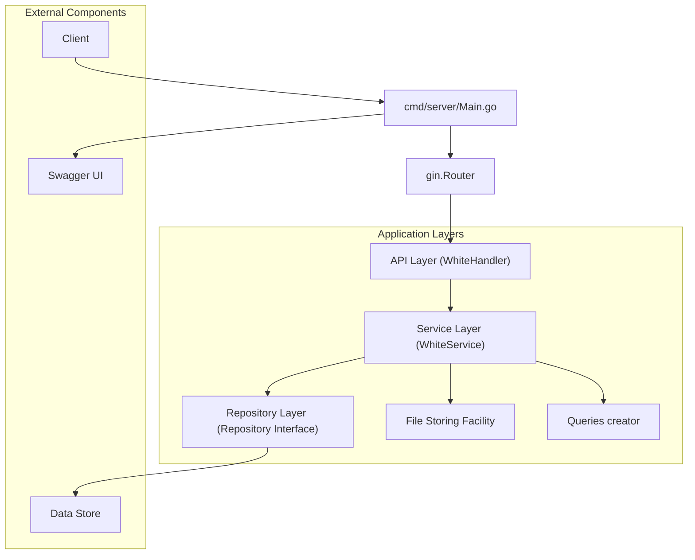

```mermaid
graph TD
    Client --> Main["cmd/server/Main.go"];
    Main --> Router["gin.Router"];
    Router --> API["API Layer (WhiteHandler)"];
    API --> Service["Service Layer (WhiteService)"];
    Service --> Repository["Repository Layer (Repository Interface)"];
    Repository --> DataStore["Data Store"];
    Service --> FileStore["File Storing Facility"];
    Service --> QueriesCreator["Queries creator\n"];
    Main --> Swagger["Swagger UI"];

    subgraph "Application Layers"
        API
        Service
        Repository
        FileStore
        QueriesCreator
    end

    subgraph "External Components"
        Client
        Swagger
        DataStore
    end
```