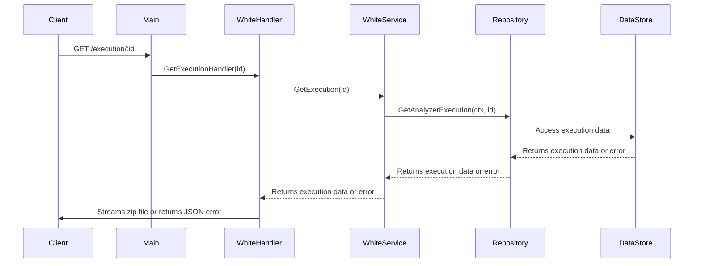

```mermaid
sequenceDiagram
    participant Client
    participant Main
    participant WhiteHandler
    participant WhiteService
    participant Repository
    participant DataStore

    Client->>Main: GET /execution/:id
    Main->>WhiteHandler: GetExecutionHandler(id)
    WhiteHandler->>WhiteService: GetExecution(id)
    WhiteService->>Repository: GetAnalyzerExecution(ctx, id)
    Repository->>DataStore: Access execution data
    DataStore-->>Repository: Returns execution data or error
    Repository-->>WhiteService: Returns execution data or error
    WhiteService-->>WhiteHandler: Returns execution data or error
    WhiteHandler->>Client: Streams zip file or returns JSON error
```